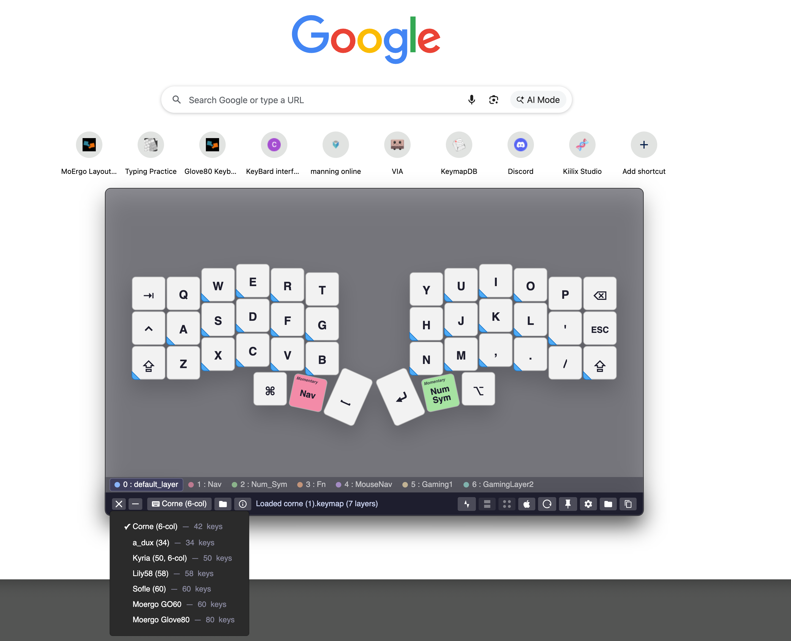
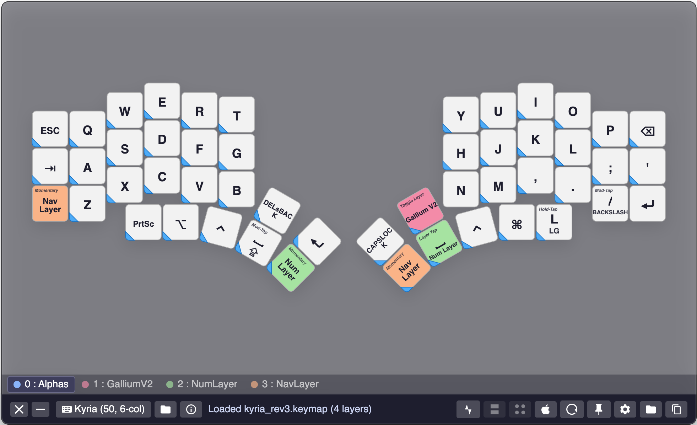
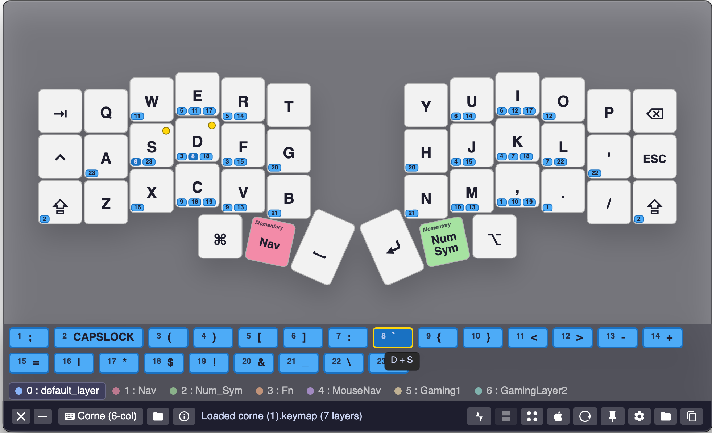
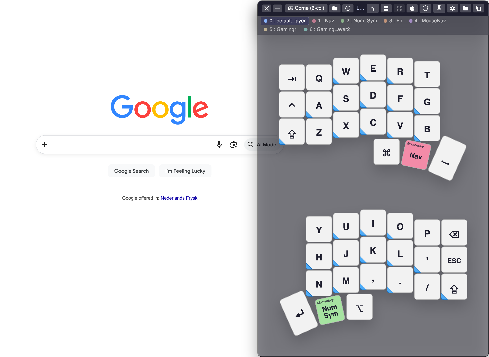
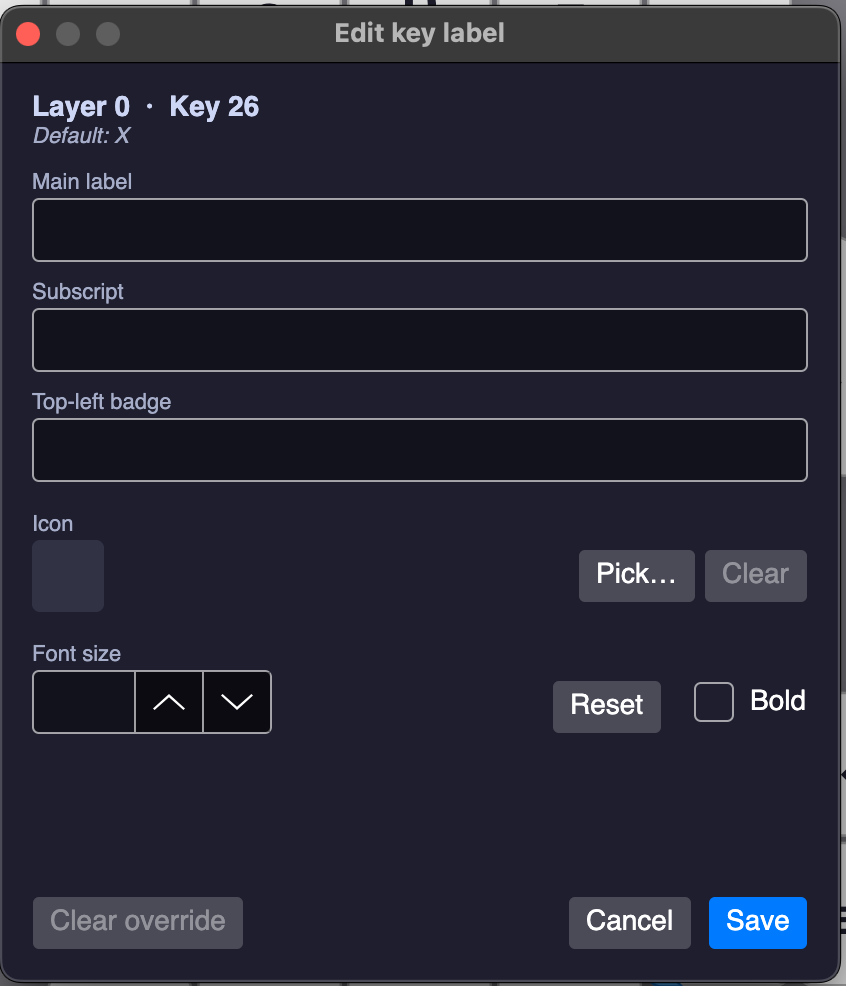
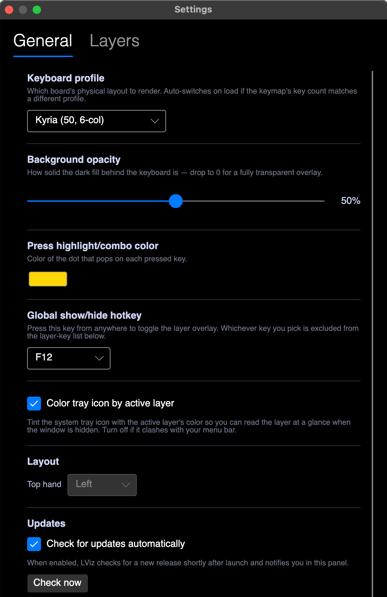
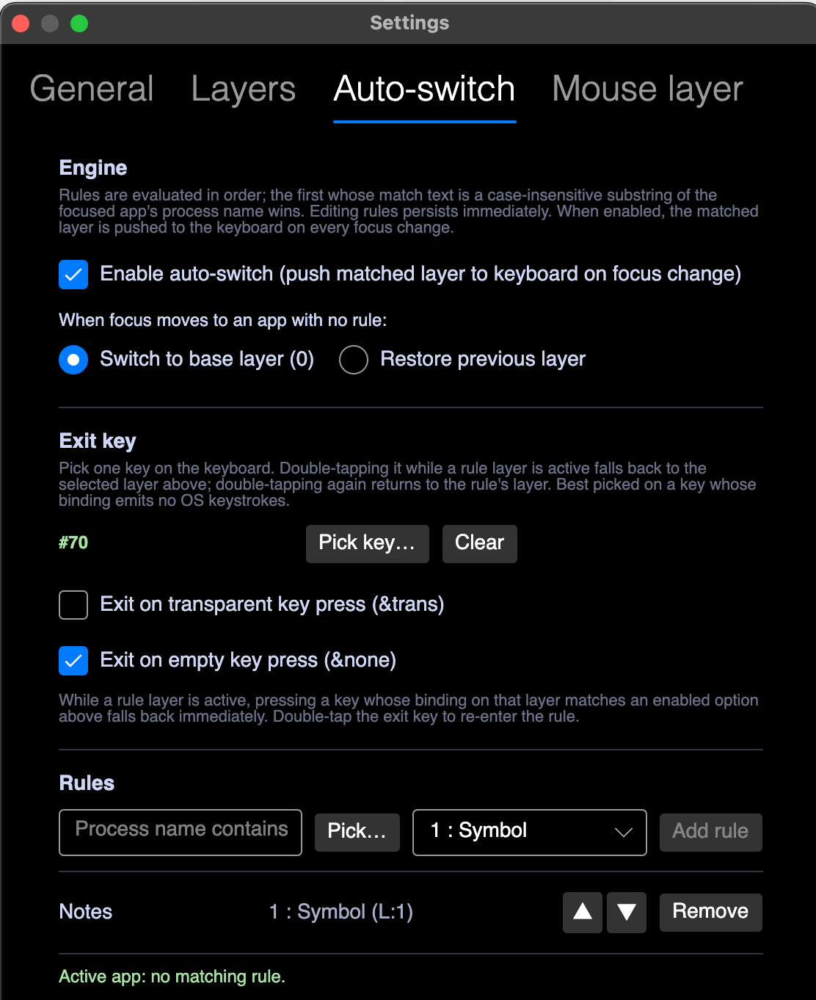

#  LViz — ZMK layer visualizer

A cross-platform desktop overlay (Windows, macOS, Linux) that mirrors
the active layer of your ZMK keyboard in real time over Raw HID.



> 📖 **Documentation** — how everything works (the overlay, device routing,
> action pipelines, the `lviz` CLI, and the wire protocol, with flow diagrams)
> lives in the **[project wiki](https://github.com/ovandongen/LViz/wiki)**. This
> README stays focused on install and build.

## What it does

LViz watches your keyboard's Raw HID endpoint and renders the live
layer state as a floating, transparency-aware overlay on your desktop.
It ships with physical layouts for seven popular ZMK boards, parses
your `.keymap` to label the keys, draws combos on top, and lets you
override any label by hand. On the two Moergo boards (Glove80 / GO60)
it also loads the Layout Editor's `.json` export directly. It also pushes layer state **back** to the
firmware: per-app auto-switch rules and a mouse-idle layer push are
both first-class features.

Forked from
[moergo-layer-viz](https://github.com/ovandongen/moergo-layer-viz) and
generalized so the engine can host arbitrary ZMK boards.

### Beyond the overlay

Over the same Raw HID transport, LViz also runs a cross-device **capability
bus**: it discovers what each connected HID device can do, **routes** actions
between devices (Device Routing), runs **action pipelines** triggered by keyboard
signals / host events / app focus, and exposes a small **`lviz` CLI** to drive it
all from scripts. See the
[wiki](https://github.com/ovandongen/LViz/wiki) for the full guide.

## Status

Early release. The core features land green and the app is in daily
use, but the public release is recent — expect rough edges. Bug
reports and feedback are very welcome on the
[issue tracker](https://github.com/ovandongen/LViz/issues).

## Supported boards

| Board | Keys |
| --- | ---: |
| Corne (6-col, foostan) | 42 |
| a_dux | 34 |
| Kyria (6-col, rev3) | 50 |
| Lily58 | 58 |
| Sofle | 60 |
| Moergo GO60 | 60 |
| Moergo Glove80 | 80 |

Adding a board means dropping its physical-layout `dtsi` into
[src/LViz.Core/Resources/](src/LViz.Core/Resources/), declaring it as
an `EmbeddedResource` in the csproj, and subclassing
[DtsiKeyboardProfile](src/LViz.Core/Layout/DtsiKeyboardProfile.cs).
[CorneProfile.cs](src/LViz.Core/Layout/CorneProfile.cs) is the
template to copy.

## Features

- Real-time layer mirror over Raw HID
- `.keymap` parser (preprocess → devicetree → interpret). The v1
  parser is intentionally lean — `#include` resolution, function-like
  `#define` macros, recursive custom-behavior resolution, and
  `/delete-node/` aren't supported yet, so heavily macro'd keymaps may
  need flattening first
- Moergo Layout Editor `.json` import (Glove80 / GO60 only) — load a
  glove80.com / go60 export directly, no `.keymap` conversion needed
- Per-app auto-switch rules with a configurable double-tap exit key
- Mouse-idle layer push (e.g. flip to a Mouse layer while you're
  moving the pointer; revert when it goes idle)
- Combo overlay — numbered pills on participating keys, with a
  matching legend strip
- Per-key label overrides (main label, subscript, top-left badge,
  font size, bold) + FontAwesome icon picker (~1895 icons)
- Native global show/hide hotkey (macOS Carbon, Windows User32; Linux
  not yet — needs per-WM cooperation that isn't shipped)
- System tray icon, optionally tinted with the active layer's colour
- Transparent custom chrome with 8-way edge resize and a position-aware
  toolbar/tabs swap
- In-app auto-updates via Velopack

## Installing

Pre-built installers are published on the
[GitHub Releases](https://github.com/ovandongen/LViz/releases) page
for every tagged version.

### Windows

Download `Setup.exe` (`win-x64`) from the latest release and run it.
SmartScreen will warn on first launch because the binary isn't
code-signed — click **More info → Run anyway**.

### macOS

Download the `.pkg` for your architecture — `osx-arm64` for Apple
Silicon, `osx-x64` for Intel.

**First install:** Gatekeeper will block the unsigned `.pkg`. Two ways
past it:

- System Settings → Privacy & Security → **Open Anyway** after the
  failed install attempt, or
- `xattr -dr com.apple.quarantine ~/Downloads/LViz*.pkg && sudo installer -pkg ~/Downloads/LViz*.pkg -target /`

**Recommended:** in the installer, click **Change Install Location**
and pick **"Install for me only"**. The app lands in
`~/Applications/LViz.app`, user-owned, and follow-up in-app updates
apply silently with no admin prompt. The default system-wide install
(into `/Applications/LViz.app`) re-prompts for the admin password on
every update that touches the bundle.

The first install always needs admin regardless of which scope you
pick; only follow-up updates differ.

### Linux

Download the `linux-x64` AppImage, `chmod +x` it, and run. The HID
layer source is a first-class feature on Linux — everything except
the global show/hide hotkey works. Use the system tray icon or window
focus to toggle the overlay instead.

## Auto-updates

LViz checks the GitHub release feed shortly after launch and applies
updates on the next restart. Toggle the background check or trigger
it manually under **Settings → General → Updates**. Velopack handles
the actual download (deltas where possible) and apply step.

## Firmware

LViz reads a vendor-defined Raw HID interface (usage page `0xFF60`,
usage `0x61`, 32-byte reports — the same convention as QMK Raw HID
and the upstream Moergo build). Your board needs to expose that
endpoint and emit layer-state (`0xFF`) and key-event (`0xF1`)
reports; the protocol reference lives in
[external/zmk-hid-protocol](external/zmk-hid-protocol).

Simplest setup is to add two modules to your ZMK `west` manifest:

- [zzeneg/zmk-raw-hid](https://github.com/zzeneg/zmk-raw-hid) — exposes
  the Raw HID endpoint over USB and BLE.
- [ovandongen/zmk-hid-viz](https://github.com/ovandongen/zmk-hid-viz) —
  generates the layer-state and key-event reports, and implements the
  push-layer commands that auto-switch and mouse-layer push send back.

…and enable `CONFIG_RAW_HID=y` in your shield config.

That covers the **layer overlay**, which is the ZMK side. The **capability bus**
(device routing, pointing, RGB, signals) is firmware-agnostic: any device that
exposes the same Raw HID interface and answers the capability manifest can join —
including **QMK** pointing devices and lighting (per-key RGB is QMK-only). For QMK
that's the [ovandongen/qmk_modules](https://github.com/ovandongen/qmk_modules)
`capability_bus` module, with worked Ploopy examples in
[ovandongen/qmk_userspace](https://github.com/ovandongen/qmk_userspace). See the
[Firmware guide](https://github.com/ovandongen/LViz/wiki/Firmware) for both paths.

Profile selection is by case-insensitive substring match against the
HID product name (see
[DtsiKeyboardProfile.cs](src/LViz.Core/Layout/DtsiKeyboardProfile.cs)) —
if the right board doesn't auto-select on connect, check that your
firmware's product string contains the board name LViz expects.

## Gallery

|   |   |
| --- | --- |
|  |  |
|  |  |
|  |  |

## Build from source

Requires the .NET 10 SDK. Clone with submodules, build, run.

```bash
git clone --recurse-submodules https://github.com/ovandongen/LViz.git
cd LViz
dotnet build
dotnet test
dotnet run --project src/LViz.App
```

## Project layout

```
LViz.sln
src/
  LViz.Core/    pure .NET — .keymap parser pipeline, Moergo .json
                loader, physical-layout profiles, Raw HID protocol
                parser, settings, diagnostics. No Avalonia.
  LViz.App/     Avalonia 11 UI, MVVM, HID pipeline, auto-switch &
                mouse-layer engines, per-key label overrides, native
                show/hide hotkey (Carbon on macOS, User32 on Windows),
                tray, custom chrome, Velopack updater.
  LViz.Tests/   xUnit fixtures.
external/
  zmk-hid-protocol/   submodule — Raw HID transport + report parser.
```

## Acknowledgements

Forked from [ovandongen/moergo-layer-viz](https://github.com/ovandongen/moergo-layer-viz);
the overlay chrome, transparency handling, native hotkey registry, and
the original HID pipeline carry over from that build largely
unchanged.

## License

MIT — see [LICENSE](LICENSE).
